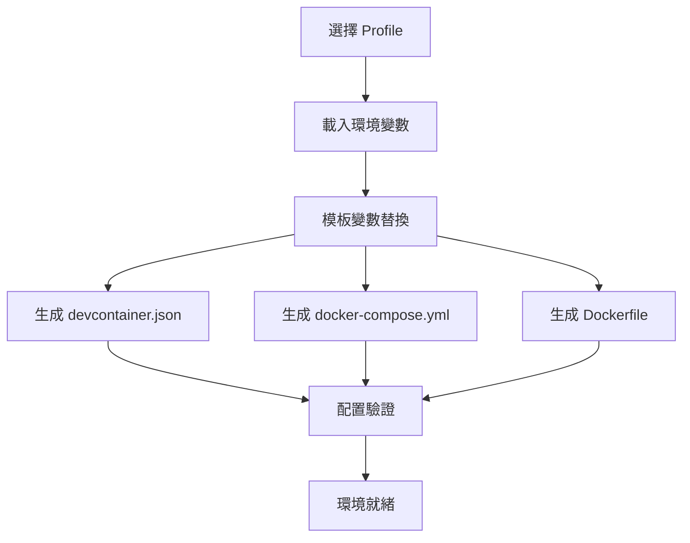
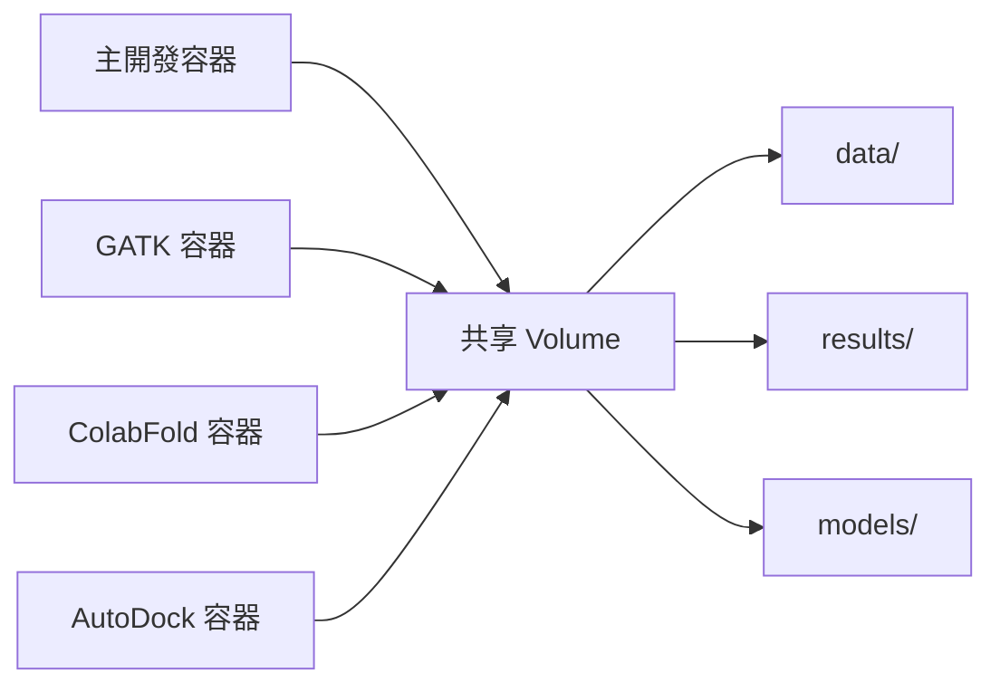

# 系統架構概覽

**文檔版本**: v2.0  
**適用系統**: Lab Container v2.0+  
**目標讀者**: 進階用戶、系統管理員、開發者

## 🏗 整體架構設計

Lab Container 採用**分層模組化架構**，提供靈活、可擴展的科學計算環境。

### 架構圖
```
┌─────────────────────────────────────────────────────────────┐
│                    Lab Container 系統                        │
├─────────────────────────────────────────────────────────────┤
│  🎯 使用者介面層 (User Interface Layer)                       │
│  ├── VS Code Dev Container 整合                              │
│  ├── 命令列工具 (CLI Tools)                                  │
│  └── 互動式設置嚮導 (Setup Wizard)                           │
├─────────────────────────────────────────────────────────────┤
│  🔧 環境管理層 (Environment Management Layer)                │
│  ├── Profile 系統 (Environment Profiles)                    │
│  ├── 套件管理器 (Package Manager)                            │
│  └── 配置生成器 (Configuration Generator)                    │
├─────────────────────────────────────────────────────────────┤
│  🧬 工具層 (Tools Layer)                                     │
│  ├── 輕量級工具 (In-Container Tools)                         │
│  │   ├── Python 生態系統                                    │
│  │   ├── R 生態系統                                         │
│  │   └── 基礎生物資訊工具                                    │
│  └── 重量級工具 (Dedicated Containers)                       │
│      ├── GATK 容器                                          │
│      ├── ColabFold 容器                                      │
│      └── AutoDock 容器                                       │
├─────────────────────────────────────────────────────────────┤
│  📦 容器層 (Container Layer)                                 │
│  ├── 主開發容器 (Main Dev Container)                         │
│  ├── 工具專用容器 (Tool-specific Containers)                 │
│  └── 網路與儲存管理 (Network & Storage)                      │
├─────────────────────────────────────────────────────────────┤
│  🖥 基礎設施層 (Infrastructure Layer)                        │
│  ├── Docker Engine                                          │
│  ├── VS Code Dev Containers Extension                       │
│  └── 主機作業系統 (Host OS)                                  │
└─────────────────────────────────────────────────────────────┘
```

## 🔧 核心組件詳解

### 1. Profile 系統 (環境配置檔案系統)

#### 設計理念
Profile 系統是整個架構的核心，提供了**預設環境模板**的抽象層。

#### 組件結構
```
.devcontainer/profiles/
├── minimal.env          # 最小化環境 (基礎 Python/R)
├── datascience.env     # 資料科學環境 (pandas, tidyverse)
├── bioinformatics.env  # 生物資訊環境 (NGS tools)
├── ml.env              # 機器學習環境 (TensorFlow, PyTorch)
├── statistics.env      # 統計分析環境 (R-focused)
└── full.env            # 完整功能環境 (所有工具)
```

#### Profile 內部結構
```bash
# 範例: datascience.env
PROFILE_NAME="Data Science"
PROFILE_DESCRIPTION="標準資料科學環境"

# 套件配置
PYTHON_PACKAGES="pandas numpy matplotlib seaborn plotly scikit-learn"
R_PACKAGES="tidyverse ggplot2 dplyr readr"

# 功能開關
ENABLE_JUPYTER=true
ENABLE_RSTUDIO=false
ENABLE_BIOINFORMATICS=false
```

### 2. 配置生成系統

#### 模板引擎
```
.devcontainer/templates/
├── devcontainer.json.template    # VS Code 開發容器配置模板
├── docker-compose.yml.template   # Docker Compose 服務模板
└── Dockerfile.template           # 容器映像建構模板
```

#### 生成流程


### 3. 套件管理架構

#### 多層套件管理
```
套件管理層次:
├── 基礎映像層 (Base Image)
│   └── mcr.microsoft.com/devcontainers/anaconda:0-3
├── Profile 套件層 (Profile Packages)  
│   ├── Conda 環境檔案 (.devcontainer/configs/conda/)
│   ├── Python requirements (.devcontainer/configs/python/)
│   └── R 套件腳本 (.devcontainer/configs/r/)
└── 運行時套件層 (Runtime Packages)
    ├── 動態安裝的 Python 套件
    ├── 動態安裝的 R 套件
    └── 使用者自訂套件
```

#### 套件衝突解決機制
```python
# 套件相依性解決順序
1. Conda base environment (最高優先級)
2. Profile-specific packages
3. Runtime-installed packages (最低優先級)

# 版本衝突處理
- 明確版本 > 版本範圍 > 無版本限制
- Profile 配置 > 使用者安裝
- 新安裝 > 既有安裝 (可選覆蓋)
```

## 🧬 工具管理架構

### 輕量級工具 (In-Container)

#### 適用條件
- 檔案大小 < 500MB
- 記憶體需求 < 2GB
- 高頻使用工具
- 無特殊GPU需求

#### 整合方式
```dockerfile
# 透過 Conda/apt 直接安裝在主容器內
RUN conda install -c bioconda fastqc samtools bcftools bedtools
```

### 重量級工具 (Dedicated Containers)

#### 適用條件
- 檔案大小 > 500MB
- 記憶體需求 > 2GB
- 特殊GPU需求
- 低頻使用工具

#### 容器化策略
```yaml
# docker-compose.tools.yml
services:
  gatk-tools:
    image: broadinstitute/gatk:latest
    profiles: ["bioinformatics", "gatk"]
    
  colabfold:
    image: colabfold/colabfold:latest
    profiles: ["structure", "colabfold"]
    runtime: nvidia
    
  autodock:
    image: ccsb/autodock-vina:latest
    profiles: ["molecular", "autodock"]
```

## 📊 資料流架構

### 資料目錄結構
```
workspace/
├── data/              # 原始資料 (只讀)
├── results/           # 分析結果 (讀寫)
├── scripts/           # 分析腳本 (版本控制)
├── models/            # 預訓練模型 (快取)
├── temp/              # 暫存檔案 (可清理)
└── backups/           # 環境備份 (自動管理)
```

### 容器間資料共享


## 🔒 安全架構

### 權限管理
```bash
# 容器內權限設計
用戶權限: vscode (非 root)
檔案權限: 
  - 腳本檔案: 755 (可執行)
  - 配置檔案: 644 (可讀寫)
  - 資料檔案: 644 (可讀寫)
  - 暫存檔案: 755 (可清理)
```

### 網路安全
```yaml
# 網路隔離設計
networks:
  devnet:
    driver: bridge
    internal: false  # 允許外部連接 (套件下載)
    
# 端口暴露最小化
ports:
  - "8888:8888"  # Jupyter Lab (僅需要時)
  - "8787:8787"  # RStudio (僅需要時)
```

## ⚡ 效能架構

### 快取策略
```bash
# 多層快取設計
1. Docker Layer Cache (建構快取)
2. Package Cache (套件快取)
   ├── pip cache (~/.cache/pip)
   ├── conda cache (~/.conda/pkgs)
   └── R package cache (~/.R)
3. Data Cache (資料快取)
   └── Model cache (models/)
```

### 資源優化
```yaml
# 資源使用限制
services:
  devcontainer:
    deploy:
      resources:
        limits:
          memory: 8G
          cpus: 4
        reservations:
          memory: 2G
          cpus: 1
```

## 🔄 擴展架構

### 水平擴展 (新 Profile)
```bash
# 新增 Profile 流程
1. 建立新的 .env 檔案
2. 定義套件配置
3. 測試環境生成
4. 文檔更新
```

### 垂直擴展 (新工具)
```bash
# 新增工具流程
輕量級工具:
  1. 更新 Conda 環境檔案
  2. 測試安裝與功能
  3. 更新文檔

重量級工具:
  1. 建立 Docker 映像
  2. 更新 docker-compose.tools.yml  
  3. 建立管理腳本
  4. 測試容器協作
```

## 📈 監控架構

### 系統監控
```bash
# 監控指標
1. 容器資源使用 (CPU, Memory, Disk)
2. 套件安裝狀態
3. 工具可用性檢查
4. 網路連線狀態
```

### 日誌管理
```bash
# 日誌層級
logs/
├── system/           # 系統級日誌
├── tools/            # 工具使用日誌  
├── errors/           # 錯誤日誌
└── performance/      # 效能日誌
```

## 🎯 設計原則

### 1. 模組化 (Modularity)
- 每個組件獨立運作
- 明確的介面定義
- 低耦合高內聚

### 2. 可擴展性 (Scalability)  
- 水平擴展 (新環境)
- 垂直擴展 (新工具)
- 向後相容性保證

### 3. 可維護性 (Maintainability)
- 清晰的代碼結構
- 完整的文檔系統
- 自動化測試覆蓋

### 4. 使用者友善 (User-Friendly)
- 直觀的命令列介面
- 豐富的錯誤訊息
- 完整的使用範例

## 📋 技術債務與改進方向

### 已知限制
1. **單機部署**: 目前不支援多機分散式部署
2. **GPU 支援**: ColabFold GPU 支援需要額外配置
3. **大資料支援**: 超大資料集 (>100GB) 支援有限

### 未來改進
1. **Kubernetes 支援**: 支援 K8s 叢集部署
2. **雲端整合**: AWS/GCP/Azure 雲端服務整合
3. **即時協作**: 多使用者同時編輯支援
4. **自動調優**: AI 輔助的效能自動調優

---

**此架構文檔將隨系統演進持續更新**  
*最後更新: 2025年7月12日*